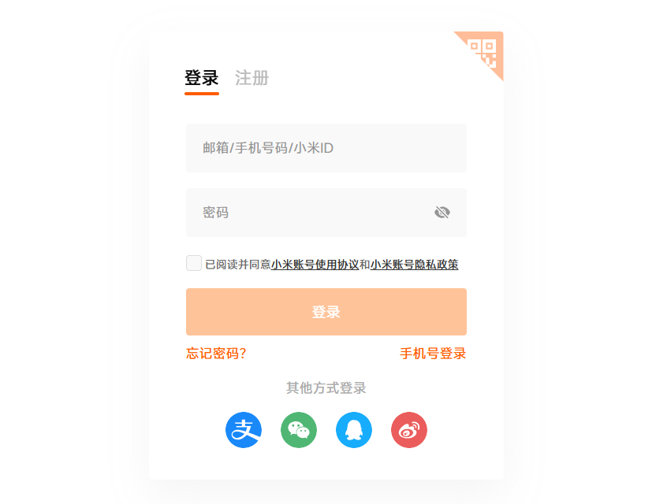
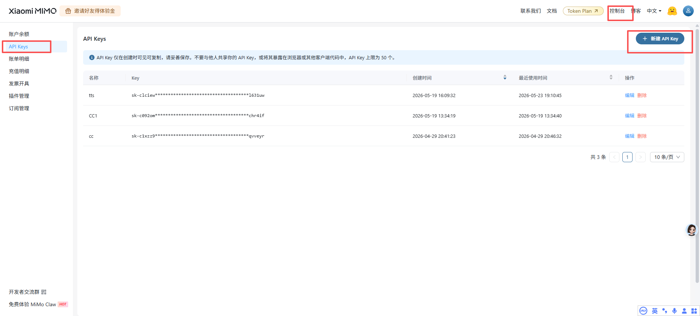
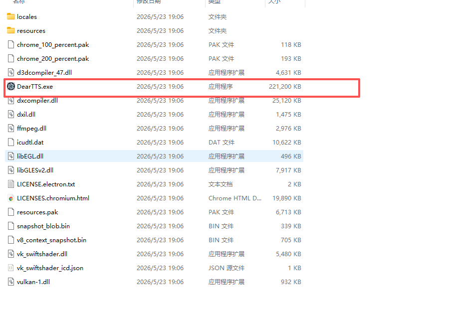
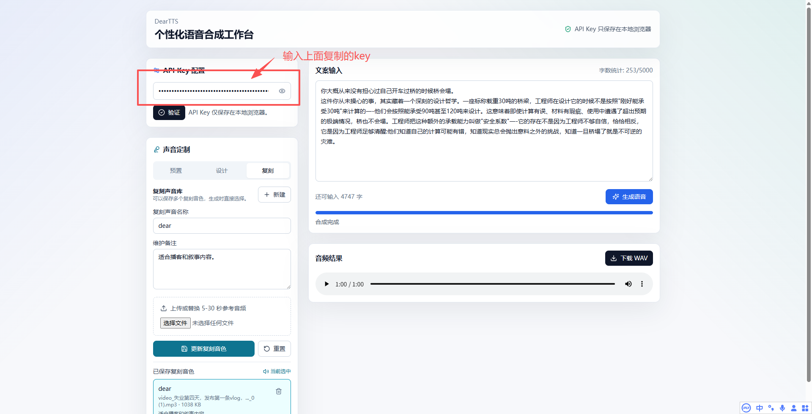
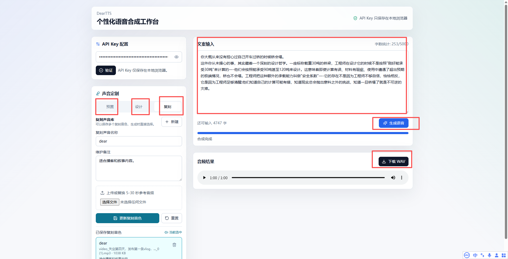

# 准备工作

当前系统基于小米 MiMo v2.5 TTS 相关模型进行开发，目前小米 MiMo 开放平台，相关模型限时免费。

## 注册小米 MiMo 开放平台账号

https://platform.xiaomimimo.com?ref=56SVU9

说明：先完成平台账号注册，后续才能创建 API Key 并调用语音合成接口。

## 申请 ApiKey（记得保存）

点击控制台 -> API Keys -> 新建 API key，先复制保存 API key。

说明：API Key 仅保存在本地，不会上报到服务端，建议先妥善保存再继续使用。

# 使用手册

## 下载 win-unpacked.zip 压缩包，解压压缩包

说明：`win-unpacked` 是桌面端可执行目录，解压后建议保持目录结构完整，不要只单独拷贝 exe。

## 点击执行 DearTTS.exe 文件

说明：双击 `DearTTS.exe` 后会打开桌面端程序，界面中所有配置都会保存在本地。

## 输入 API key 进行验证

说明：输入 API Key 后点击“验证”，可先检查 Key 是否可用；右侧小眼睛可以显示或隐藏明文。

## 相关功能介绍

### API Key 配置

API Key 输入框默认以密码形式展示，支持本地保存和显隐切换，便于在桌面环境下安全使用。

首次使用时，需要将小米 MiMo 开放平台申请到的 API Key 粘贴到输入框中，然后点击“验证”。验证通过后，程序会把 API Key 保存到本地，下次打开软件时会自动读取。输入框右侧的小眼睛按钮用于临时显示或隐藏 API Key，适合需要核对 Key 是否粘贴正确的场景。

### 声音预置

提供官方预置音色列表，可直接选择适合的声音类型用于合成。

预置音色适合快速生成语音，不需要额外配置。用户可以在列表中选择不同的官方音色，例如中文女声、中文男声、英文音色等。选中后，直接在右侧输入文案并点击“生成语音”，系统会使用当前选中的预置音色进行合成。

### 声音设计

支持输入声音名称和声音描述，保存为本地定制音色，后续可继续维护、更新或删除。

声音设计适合通过自然语言描述想要的声音风格。可以填写一个便于识别的“定制声音名称”，再在“声音描述”中写明声音特征，例如性别、年龄感、语速、情绪、口音、适用场景等。保存后，该定制音色会出现在本地音色列表中，后续可以点击选择，也可以修改描述后再次保存更新。

### 声音复刻

支持保存多个复刻音色，每个复刻音色都可以维护名称、备注和参考音频；生成时可直接选择对应音色。

声音复刻适合根据一段参考音频生成接近该声音特征的语音。使用时先填写复刻声音名称和备注，再上传 5-30 秒参考音频并保存。已保存的复刻音色会显示在列表中，生成语音前点击要使用的复刻音色即可。若后续想替换参考音频，可以选择该音色后重新上传音频并保存更新。

### 文案输入与生成

支持输入或粘贴文案，最多 5000 字，点击“生成语音”后会调用 MiMo v2.5 TTS 进行合成。

文案输入区用于填写最终要合成为语音的文本，支持中文、英文和中英混合。输入框上方会显示当前字数，超过 5000 字时不能生成。确认 API Key、声音模式和文案都准备好后，点击“生成语音”，下方会显示生成进度和状态提示。

### 音频试听与下载

生成完成后可直接在线播放，并通过下载按钮保存为本地 WAV 文件。

合成成功后，音频结果区会显示播放器，可以直接点击播放试听。如果效果满意，可以点击“下载 WAV”保存到本地。下载文件会自动使用 `deartts_年月日_时分秒.wav` 的命名格式，便于后续整理。

说明：生成结果会显示在下方音频区域，便于试听、回放和下载。
